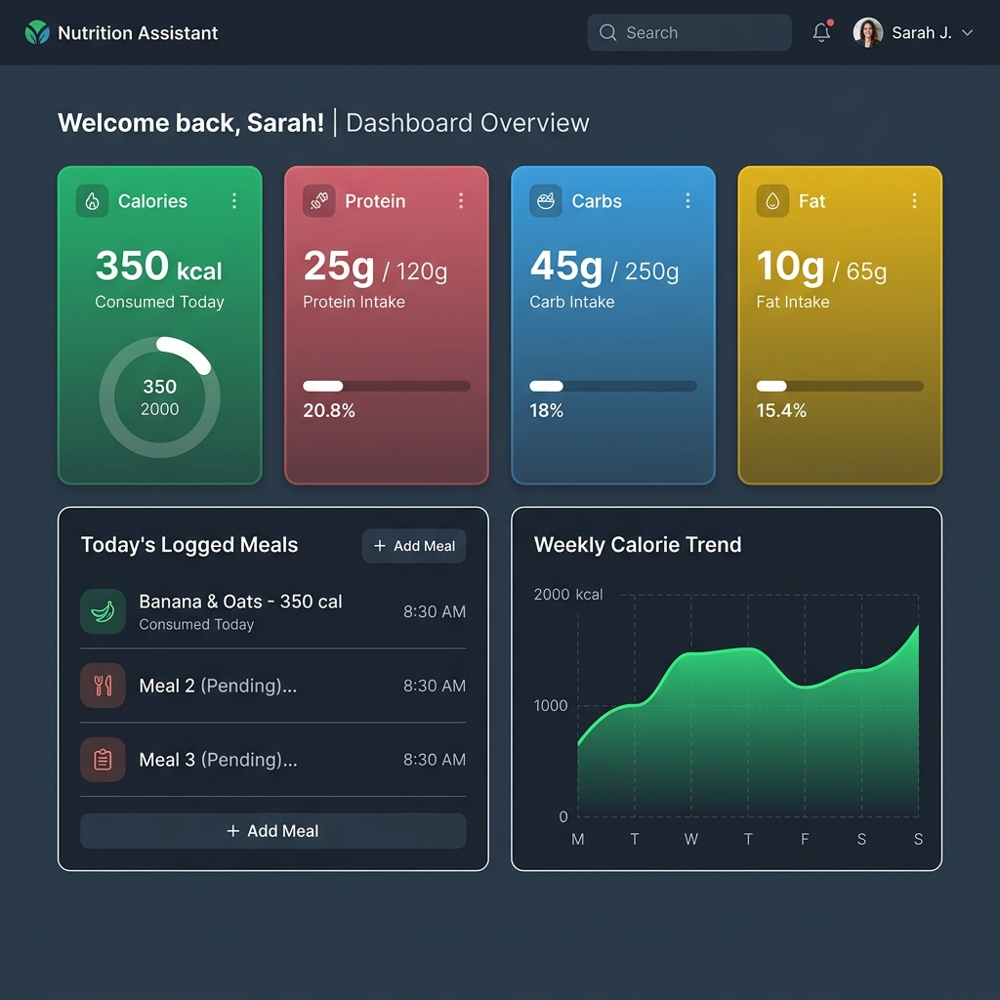

# 🥗 Nutrition Assistant Walkthrough & UI Showcase

This document provides a summary of the UI enhancements completed for the **Nutrition Assistant** project.

---

## 🎨 New Dashboard UI Preview
Below is the high-fidelity visual mockup of the new dashboard interface running in the browser:

---

## 🚀 Key Visual & Feature Upgrades
1. **High-Contrast Cards:** The statistic widgets (Calories, Protein, Carbs, Fats) now have clear background highlights in soft emerald, rose, sky blue, and gold.
2. **Weekly Trend Charts:** Displays your daily logging progress dynamically on the screen.
3. **Typography:** Styled entirely in the premium **Inter** font family for a neat, clean layout.
